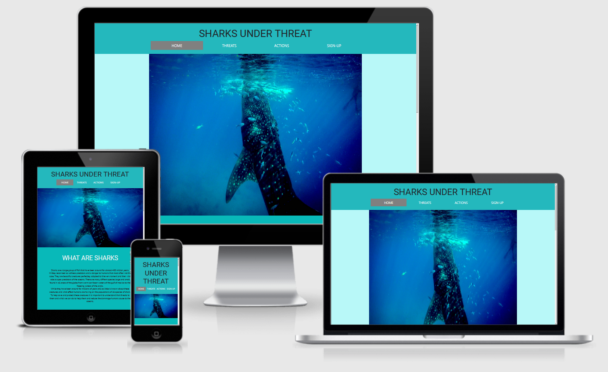

# Sharks-Under-Threat (Milestone Project 1)

[Visit My Site Here](https://ibrazyi.github.io/Milestone-Project-1-V2/)

## Overview
This website is an information hub for people who care about sharks and other marine life. What the threats to these creatures are and also the ways in which they can,
in thier every day lives help reduce the impacts they have on sharks and the enviroment they live in. With a bright and ocean theme the intention is to use large pictures
with short paragraphs of texts to keep peoples attention and get the info across quickley.

## Table of Contents

[UX](#ux)

[Features](#features)

[Technolgies Used](#technolgies)

[Testing](#testing)

[Deployment](#deployment)

[Credits](#credits)

## UX
### User Stories
#### First Time Visitor
- A first time visitor to the site will want to be drawn in by the colour and the images making them want to discover the information underneath.
- A first time visitor wants to be able to navigate the website easially know what page they are currently on.
- A first time visitor wants to see short but intresting pieces of text to keep thier attention and help them emphapihse with the cause of the site.
#### Returning User
- A returning visitor will want to be able to get thier friends to sign up to the page easially to support their cause.
- A returning visitor wants to find the social media information quickley and be taken to the relevant site.

### Strategy
- The strategy of the site is to provide a platorm to learn information about the threats to sharks and what the visitor can do to help. This creates more awareness of the issue and encourages people to do somthing about it.

### Scope
- Provide visitors with basic but intresting information.
- Provide a clean looking UX for easy navigation and information absorbsion.
- Provide a call to action to get the visitor involved.
- Empower visitors encoraging them to make a diffrence themselves.

### Structure
#### Interaction Design
- Design a responsive website, that looks good at works well at all screen sizes.
- Responsive navigation that allows users to easily navigate between pages and know what page they are on at all times.

#### Information Architecture
- Content needs to be sectioned in a way that allows for easy uptake with little distractions.
- Images need to be displayed to flow with the page and not distract from the information sections.
- Content of page needs to flow between sections for easy page navigation with clear titles and breaks.

### Skeleton
#### Wireframes
- Mobile Wireframes     
- Deskop/Tablet Wireframes        

#### Information Design
- Information is split into small sections each with its own heading and image to sum up the information before reading.
- More factual information is represent in smaller information boxes with seperate headings and diffrent styling to main text.

#### Interface Design
- Information is layed out in a top to bottom manner allowing for easy navigation of the page.
- Information with images are located within the same sections so it is obvious that the images relate to the information.

#### Navigation Design
- Navigation is located at the top of the page showing importance and ease of acsess for the user.
- Current page is highlighted so it is obvious what page the user is currently on so they dont get lost.

### Surface
#### Typography
Two fonts were selected for the use on this site they are Roboto and Oxygen, both are from [GoogleFonts](https://fonts.google.com/).
- Roboto, this was used for the headings and titles of the page as it is a bolder and sharper font.
- Oxyen, this was used for the content of the page slightley less bold and with more flow than Roboto. 

#### Colour Scheme

The aim of the colour scheme was to represent the ocean to tie in the theme and the information. With this in mind the colours are all variants of blue slowley darkening as you get deeper into the page. The brighter blue of the header represents to sky.

### Features
The site is split up into four diffrent pages, each is designed to be responsive at all screen sizes and complete with working external links.
1. Home - Containing a Boostrap 5 Carousel, an introduction to the site and three small information cards about seperate sharks.
2. Threats - Containing Multiple sections containing images and text displayed in an alternating manner.
3. Actions - Containing Multiple sections containing images and text displayed in an alternating manner.
4. Signup - Containing a large background image. Complete with sign up section with forms containing; Name, Email, radio selector and submit button.

#### Existing Features 
- All pages contain a Boostrap 5 Nav Bar, complete with links to all other pages and displays active page.
- All pages contain footer, using font awesome social media icons each with hover change of colour effect.
- Boostrap 5 Carousel, consisting of 3 images on a cycle with information labels about each picture.

#### Features Left to Implement
- Possibilty of adding another page containing a gallery of multiple images of sharks, this would be responsive and contain mouseover elements.

### Technologies Used
#### Languages
- HTML5 - Used as the structure of the website and container for content.
- CSS3 - Used to style and manipuate content with effects.
#### Libaries
- [Boostrap](https://getbootstrap.com/) - Used for responsive design and templates for nav bar, carousel and page layout.
- [GoogleFonts](https://fonts.google.com/) - Used as the libary for both fonts used in the webpage.
- [FontAwesome](https://fontawesome.com/) - Used for social media icons in footer.
- [Jquery](https://getbootstrap.com/docs/4.2/getting-started/introduction/) - Used to allow functionality of Boostrap carousel.
#### Programs
- VS Code - Where all coding took place, also using intergrated terminal.
- Git Hub Desktop - Used to create repository and link to online Git Hub profile.
- Git Hub - Used to host and display website.
- Adobe XD - Used for the creation of wireframes.
- [Unsplash](https://unsplash.com/) - Used to obtain most images, ready to download in specified sizes.
- [IAmResponsive](http://ami.responsivedesign.is/) - Used to test responsiveness of website, also for image displaying responsiveness at top of README.
- [Coolors](https://coolors.co/) - Used to display website colour pallet.
- [HTMLValidator](https://validator.w3.org/) - Used to check HTML code for errors.
- [CSSValidator](https://jigsaw.w3.org/css-validator/) - Used to check CSS code for errors.

## Testing
### Code Validators
- HTML Validator - No errors to show.
- CSS Validator - No errors to show.

### Devices
- Iphone 6/7/8 - Displays as intended.
- Samsung Galaxy S9 - Displays as intended.
- Samsung Galaxy S20 FE - Displays as intended.
- Ipad - Displays as intended.
- Laptop - Displays as intended.
- Desktop - Displays as intended.

### Browsers 
- Chrome - No errors.
- Firefox - No errors.
- Internet Explorer - Images slow to load.
- Microsoft Edge - No errors.
- Opera - No errors.
- Safari - No errors.

## Deployment
### Creating Repository
1. Created new file inside documents folder named "Coding Course" and within that created a file called "Sharks-Under-Threat(Milestone Project 1)"
2. Opened GibHub Desktop and selected "New Repository"
3. Gave the project name "Sharks-Under-Threat" and clicked "Create Repository"
4. Opened the repository in VS Code
5. Created index.html and README.md pages
6. Opened up local terminal and "Git Added" both pages.
7. Commited both pages using "Git Commit".
8. Pushed changed with "Git Push" adding my work to my Git Hub page.
9. Opened my GitHib page to see the changes.

### Viewing Site
1. After logging in to GibHub i went to the "settings" tab.
2. Upon scrolling down to "Danger Zone" i set the repository to "Public".
3. Scrolling back up to "GitHub Pages" set the source "Branch-main", "File-Root" and selected save.
4. After reloading and scrolling back down to "GitHub Pages" selected the link where my site had been published.

## Credits
### Technical
- Social Media Icons- Matt Rudge Code Insitute resume project.
- Boostrap 5 - Carousel, Nav Bar, List Section and structure for page layout.
- Google Fonts - All fonts
- Font Awesome - Social Media Icons

 ### Content 
 - [SharksTrust](https://www.sharktrust.org/) - Website inspiration.
 - [BiteBack](https://www.bite-back.com/?v=79cba1185463) - Website inspiration.
 - [Wikipedia](https://en.wikipedia.org/wiki/Main_Page) - Info used for Shark Information sections.

 ### Media 
Images from
- [Unsplash](https://unsplash.com/)
- [NationalGeographic](https://www.nationalgeographic.com/)

 ### Acknowledgements
- Code institute - Running the course and providing this oppertunity.
- Maranatha Ilesanmi (Mentor) - Feedback and support during the project.
- Slack Community - Peer reviewing my work.

